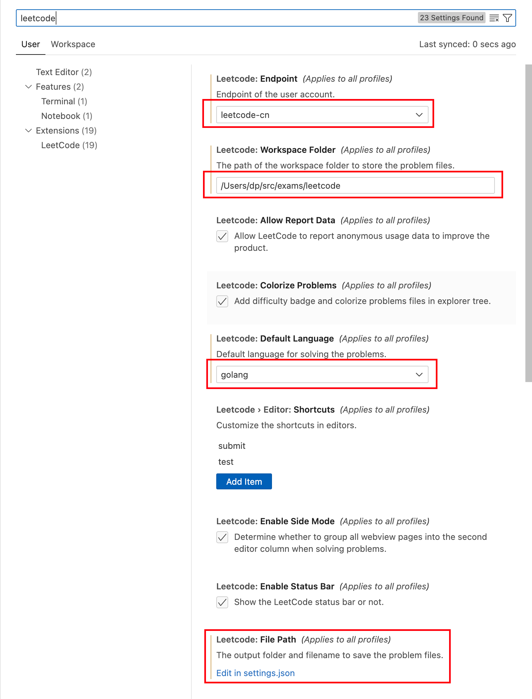

# leetcode

运行条件：

1. 使用 VSCode 作为编辑器
2. 安装 LeetCode 插件
3. 安装 Node.js
4. 配置 LeetCode 插件

配置：



settings.json:

```json
{
  "leetcode.endpoint": "leetcode-cn",
  "leetcode.workspaceFolder": "/Users/dp/src/exams/leetcode",
  "leetcode.defaultLanguage": "golang",
  "leetcode.showDescription": "Both",
  "leetcode.hint.configWebviewMarkdown": false,
  "leetcode.filePath": {
    "default": {
      "folder": "000${id}.${kebab-case-name}",
      "filename": "main.${ext}"
    }
  }
}
```
